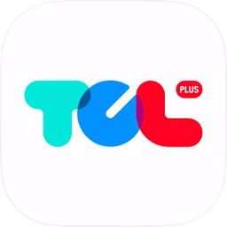

# TCL+ for Home Assistant



将 **TCL+** 账号中的智能家电接入 Home Assistant。使用 TCL+ 手机应用扫码授权后，集成会自动发现设备，并根据各产品的云端功能定义生成状态和控制实体。

**当前版本：1.0.0** · [下载与版本记录](https://github.com/WangYuhang-CN/TCL-HA/releases) · [问题反馈](https://github.com/WangYuhang-CN/TCL-HA/issues)

## 功能

- **扫码授权**：通过 TCL+ App 确认登录，凭证保存在 Home Assistant 配置项中。
- **自动适配**：按设备所属产品的物模型识别功能，生成传感器、开关、程序选择和数值控制。
- **能力识别**：洗烘程序选项结合设备上报的能力列表过滤，控制参数遵守该产品的取值范围和步长。
- **状态同步**：每台设备每 30 秒读取一次状态；操作后通过云端回读确认结果。
- **诊断支持**：保留原始字段，并提供模型诊断下载，便于排查问题和反馈新型号。

## 支持范围

| 设备 | 接入方式 | 实机验证情况 |
|---|---|---|
| G100T7R-DIS 洗衣机 | 专用状态、操作按钮及物模型属性控制 | 已验证 |
| H100T7R-BS 干衣机 | 专用状态、操作按钮及物模型属性控制 | 已验证 |
| 其他 TCL+ 设备 | 按各产品的物模型自动生成属性实体 | 待对应型号验证 |

其他型号能否读取和控制，取决于它是否使用相同的国内 TCL+ 云端接口，以及云端是否提供有效的功能定义。新型号的物模型获取失败时，集成先提供只读状态；重新加载后会重试获取模型。

当前提供属性级实体，暂未提供通用空调、风扇或灯光专用实体（`climate`、`fan`、`light`）。全球 TCL Home、其他云端协议、事件订阅和服务调用暂未支持。

## 自适应规则

集成在启动或重新加载时读取每个产品的云端物模型，按属性权限、类型和取值约束生成实体：

| 属性定义 | 生成的实体 |
|---|---|
| 可读写的布尔值，取值明确为 0/1 | 开关 |
| 可读写的数值枚举 | 程序或选项选择 |
| 可读写的整数、普通浮点数，范围和步长有效 | 数值控制 |
| 新型号的只读布尔值 | 二值传感器 |
| 新型号的其他只读属性 | 状态传感器 |
| 模型字段和实际上报的状态字段 | 保留原值的诊断传感器 |

复杂数组、未知缩放协议及无效规格保留只读；数组控制仅保留两个历史型号已有的控件。设备列表标记为只读账号时，不生成控制实体。

两个历史型号的物模型获取失败时，可使用各自的归档规格；其他型号先提供只读状态。云端模型成功返回但取消可写权限时，以当前模型为准。

洗烘程序选项结合各设备上报的程序能力过滤，写入前重新校验。其他型号使用自己的模型标签和属性控件；已有两台洗烘机保留专用状态及启动、暂停保护。

## 安装

目前采用手动安装。

1. 下载 [Release 安装包](https://github.com/WangYuhang-CN/TCL-HA/releases)或仓库源码，并解压。
2. 将其中的 **整个 `custom_components/tcl_plus` 文件夹**复制到 Home Assistant 配置目录下的 `custom_components` 中。
3. 重启 Home Assistant。

安装后的目录应为：

```text
<Home Assistant 配置目录>/
└── custom_components/
    └── tcl_plus/
        ├── __init__.py
        ├── manifest.json
        ├── translations/
        └── ...
```

Home Assistant 运行时只需要 `tcl_plus` 文件夹。

## 授权与使用

1. 在 Home Assistant 中打开 **设置 → 设备与服务 → 添加集成**，搜索 **TCL+**。
2. 使用已绑定设备的 TCL+ 手机应用扫描页面上的二维码，并确认授权。
3. 回到 Home Assistant 点击提交，等待设备与实体加载。
4. 在设备页查看状态、使用可用控件，或将实体添加到自己的仪表盘。

二维码未显示时，可打开页面提供的二维码链接；过期时选择“重新生成二维码”。设备必须已经绑定到扫码使用的 TCL+ 账号。

账号新增设备或云端功能定义变化后，在“设备与服务”中重新加载 **TCL+** 集成。状态新增字段会在后续轮询中自动生成诊断传感器。

控制请求收到云端 ACK 后，控件暂时显示目标值，并通过状态回读确认。实体属性 `last_write_status` 依次显示 `pending`、`confirmed`，或在约 90 秒仍未确认时显示 `not_confirmed` 并恢复云端实际值。控制指令不会因回读延迟而重复发送。

原始诊断传感器始终显示云端回读值；数组、对象和长文本的完整内容可在 `raw_value` 属性中查看。

## 升级

备份已安装的 `custom_components/tcl_plus`，用新版本覆盖整个文件夹，然后重启 Home Assistant。保留现有集成配置项；授权有效时无需重新扫码。

## 常见情况

| 情况 | 处理方式 |
|---|---|
| 提交后提示授权未完成 | 在 TCL+ App 中确认授权，再回到 Home Assistant 提交 |
| 新型号只有只读状态 | 重新加载集成重试获取模型，并下载诊断查看模型来源 |
| 部分字段显示“未知” | 设备尚未上报该字段；缺失数据会保持未知 |
| 操作后状态暂未更新 | 等待云端回读；未确认的操作约 90 秒后恢复显示实际云端值 |
| 登录凭证失效 | 按 Home Assistant 的重新授权提示再次扫码 |
| 希望通过 HACS 安装 | 当前版本提供手动安装，尚未配置 HACS 发布元数据 |

设备动作还会受到程序阶段、远程控制权限和设备自身规则影响。

## 问题反馈

反馈问题时，请提供设备型号、Home Assistant Core 版本、集成版本、复现步骤、相关日志和集成诊断文件。

诊断文件包含产品型号、模型来源、字段和控制规格，不包含账号凭证、设备 ID、用户设备名或实际状态值。模型来源为 `cloud`、`archived` 或 `status_only`，分别表示云端模型、历史规格和只读状态。附带日志时请检查并移除账号凭证和个人信息。

## 开发

在源码仓库中安装开发依赖并运行离线检查：

```shell
python -m pip install -r requirements-dev.txt
python -m pytest -q
ruff check custom_components tests scripts
```

`tests/fixtures` 只保留测试所需的脱敏样本，测试无需真实账号或联网。实体工厂测试使用最小 Home Assistant 接口替身；1.0.0 的真实 Core 加载与设备行为仍需安装验证。

分支提交和 Pull Request 会自动运行 GitHub Actions 检查，也可从 Actions 页面手动运行 CI。

本地构建安装包：

```shell
python scripts/build_release.py
```

安装包按文件白名单构建，仅包含 `custom_components/tcl_plus`、本 README 和 LICENSE。ZIP 和 SHA-256 校验文件输出到 `releases/`，该目录已被 Git 忽略。

## 发布

版本记录和发布说明统一保存在 GitHub Releases。

更新 `custom_components/tcl_plus/manifest.json` 的版本，完成 Home Assistant 安装、已有实体兼容性及设备控制回读验证后，提交并推送源码，再推送对应版本标签：

```shell
git tag v1.0.0
git push origin v1.0.0
```

流水线会运行代码检查和离线测试，核对标签与集成版本，随后构建安装包并创建 GitHub Release，上传安装包和 SHA-256 校验文件，并由 GitHub 自动生成版本说明。需要补充中文说明时，可在 Release 页面编辑正文。

工作流使用 GitHub 自带的 `GITHUB_TOKEN`，无需配置个人令牌或 TCL+ 账号凭证。检查失败或标签与版本不一致时停止发布；已有同名 Release 时不会覆盖。

预发布时，将 manifest 版本设为 `1.0.0-rc.1`，提交后推送 `v1.0.0-rc.1`。带后缀的版本会标记为预发布，不设为最新正式版；验证完成后更新为 `1.0.0` 并推送 `v1.0.0`。

本地可先核对标签并生成安装包：

```shell
python scripts/build_release.py --tag v1.0.0
```

## 许可证

本项目采用 [MIT License](LICENSE)。
